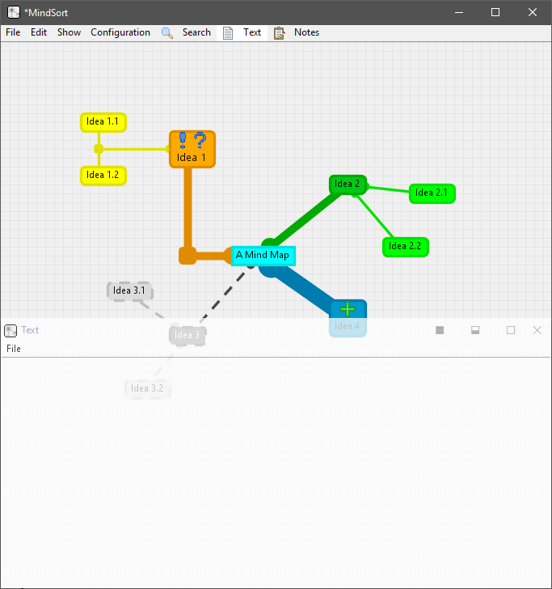

# MindSort
Many times, when taking notes of ideas or projects, either too many text files or one giant text file are created in the process. Ordenize and maintain everthing quikly becomes too complicated.

MindSort follows the idea of a mind map, but implemented as simple as possible, with you being free to assign the meaning to each conection, color, and various other propeties.

## Usage
Following the same idea of a simple text editor, you can create and edit `.mind` files.

You can create `Modules` and change it's `title`, `description`, `color`, `icons`, and `border style`.

You can connect `Modules` with `Connections` and change it's `description`, `border style` and `width`.

And you can create `Nodules` within `Connections`to change it's path.

## Instalation
Provided you have *Java Runtime Environment (JRE)* installed, it can be simply loaded and will be ready to use.
