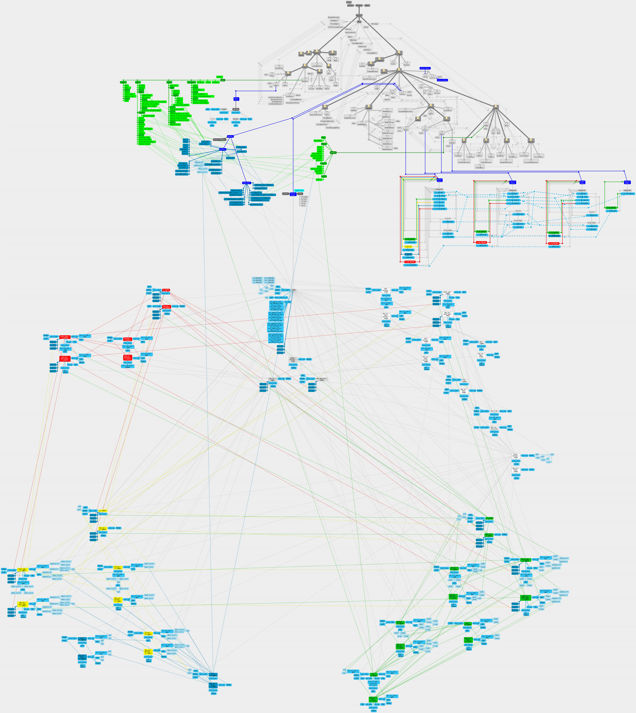

# Inside MindSort
MindSort works by implementing different states, defined by the user's input.

So, instead of deciding what should happen according with the given input, the program instead listen to only very specific inputs, and these only performs simple operations and change the current state, which change the inputs listened.

The benefit is that there is no space for unexpected behaviors, but the negative side is that all actions need to be clearly defined and mapped inside a given state.

